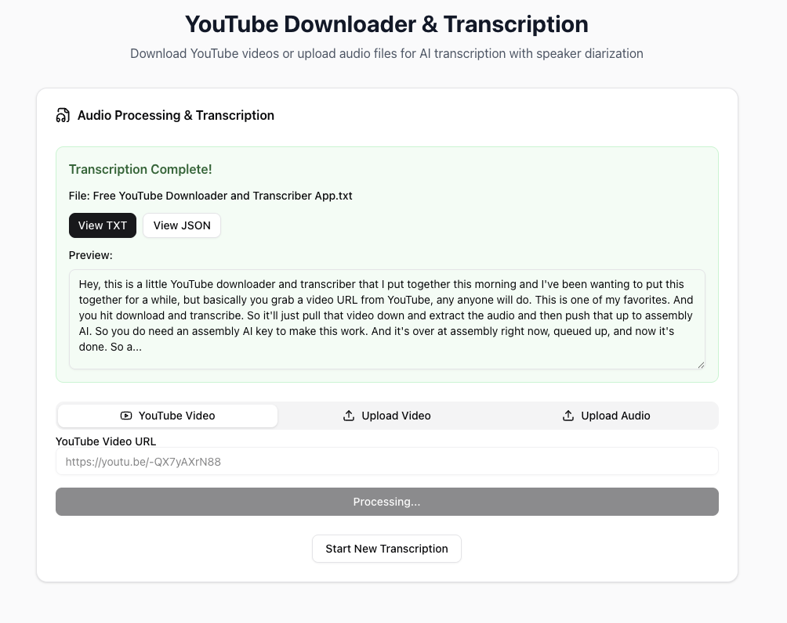

# YouTube Downloader & Transcription App

A Next.js web application that downloads YouTube videos, processes podcast feeds, and transcribes audio files using AI. Features include YouTube video downloading, podcast RSS feed parsing, audio extraction from MP4 files, and AI-powered transcription with speaker diarization using AssemblyAI.

## Features

- 🎥 **YouTube Video Download**: Download videos from YouTube and extract audio
- 🎙️ **Podcast Transcription**: Parse RSS feeds and transcribe podcast episodes directly from URLs
- 📁 **File Upload**: Upload MP4 videos or MP3/M4A audio files
- 🔍 **Episode Search**: Search and filter podcast episodes with user-friendly duration display
- 🤖 **AI Transcription**: Transcribe audio using AssemblyAI with speaker diarization
- 📝 **Multiple Output Formats**: Get transcripts in both TXT and JSON formats
- 👁️ **Preview & Copy**: View transcripts in-app with copy-to-clipboard functionality
- 🎨 **Modern UI**: Clean, responsive interface built with Shadcn, Tailwind CSS and Radix UI

## Screenshot




## Prerequisites

Before installing, ensure you have the following installed on your system:

- **Node.js** (v18 or higher)
- **npm** or **yarn**
- **FFmpeg** (for audio extraction from video files)
- **AssemblyAI API Key** (for transcription services)

### Installing FFmpeg

#### macOS
```bash
brew install ffmpeg
```

#### Ubuntu/Debian
```bash
sudo apt update
sudo apt install ffmpeg
```

#### Windows
Download from [FFmpeg official website](https://ffmpeg.org/download.html) or use chocolatey:
```bash
choco install ffmpeg
```

## Installation

1. **Clone the repository**
   ```bash
   git clone https://github.com/yourusername/youtube-downloader.git
   cd youtube-downloader
   ```

2. **Install dependencies**
   ```bash
   npm install
   ```

3. **Set up environment variables**
   
   Create a `.env.local` file in the root directory:
   ```env
   ASSEMBLYAI_API_KEY=your_assemblyai_api_key_here
   ```
   
   Get your AssemblyAI API key from [AssemblyAI Console](https://www.assemblyai.com/dashboard/)

4. **Set up yt-dlp binary permissions** (if needed)
   ```bash
   chmod +x app/bin/yt-dlp
   ```

5. **Run the development server**
   ```bash
   npm run dev
   ```

6. **Open the application**
   
   Navigate to [http://localhost:3000](http://localhost:3000) in your browser

## Usage

### YouTube Video Transcription

1. Select the **"YouTube Video"** tab
2. Enter a YouTube URL (e.g., `https://www.youtube.com/watch?v=dQw4w9WgXcQ`)
3. Click **"Download & Transcribe"**
4. Wait for the process to complete (download → extract audio → transcribe)
5. View the transcript using **"View TXT"** or **"View JSON"** buttons

### Video File Upload

1. Select the **"Upload Video"** tab
2. Choose an MP4 file from your computer
3. Click **"Upload & Transcribe"**
4. The app will extract audio and transcribe it automatically

### Audio File Upload

1. Select the **"Upload Audio"** tab
2. Choose an MP3 or M4A file from your computer
3. Click **"Upload & Transcribe"**
4. The app will transcribe the audio directly

### Podcast Transcription

1. Select the **"Podcast"** tab
2. Enter either:
   - **RSS Feed URL** (e.g., `https://feeds.megaphone.fm/podcast-name`)
   - **Direct Audio URL** (e.g., `https://example.com/episode.mp3`)
3. For RSS feeds:
   - Browse the episode list in the popup dialog
   - Use the search bar to filter episodes by title or description
   - Click on an episode to select and transcribe it
4. For direct URLs: Transcription starts immediately
5. The app streams audio directly to AssemblyAI (no local downloads)

**Supported Audio Formats:**
- MP3 (.mp3)
- M4A (.m4a) 
- WAV (.wav)
- AAC (.aac)

### Viewing Transcripts

- **TXT Format**: Plain text transcript with speaker labels
- **JSON Format**: Detailed transcript with timestamps, confidence scores, and speaker information
- **Copy Feature**: Click the "Copy" button to copy transcript content to clipboard

## API Endpoints

The application provides several API endpoints:

### POST `/api/youtube-download`
Downloads YouTube video and extracts audio as MP3.

**Request Body:**
```json
{
  "url": "https://www.youtube.com/watch?v=VIDEO_ID"
}
```

**Response:**
```json
{
  "audioPath": "/uploads/audio/video_title.mp3",
  "title": "Video Title"
}
```

### POST `/api/upload`
Handles file uploads and audio extraction from MP4 files.

**Request:** Multipart form data with `file` field

**Response:**
```json
{
  "audioPath": "/uploads/audio/filename.mp3",
  "message": "File uploaded successfully"
}
```

### POST `/api/transcribe`
Transcribes audio files using AssemblyAI.

**Request Body:**
```json
{
  "audioPath": "/uploads/audio/filename.mp3",
  "filename": "original_filename"
}
```

**Response:**
```json
{
  "filename": "transcript.txt",
  "txtContent": "Transcribed text...",
  "jsonContent": "{...}",
  "txtDownloadUrl": "/uploads/transcripts/transcript.txt",
  "jsonDownloadUrl": "/uploads/transcripts/transcript.json"
}
```

### POST `/api/podcast`
Handles podcast RSS feed parsing and direct audio URL processing.

**Request Body:**
```json
{
  "url": "https://feeds.megaphone.fm/podcast-name"
}
```

**Response (RSS Feed):**
```json
{
  "type": "rss",
  "episodes": [
    {
      "title": "Episode Title",
      "description": "Episode description...",
      "pubDate": "2024-01-01T00:00:00Z",
      "audioUrl": "https://example.com/episode.mp3",
      "duration": "3600",
      "guid": "episode-guid"
    }
  ]
}
```

**Response (Direct Audio):**
```json
{
  "type": "audio",
  "audioUrl": "https://example.com/episode.mp3",
  "title": "episode"
}
```

### GET `/api/files`
Serves files from the uploads directory.

**Query Parameters:**
- `path`: Relative path to file in uploads directory

## Project Structure

```
youtube-downloader/
├── app/
│   ├── api/
│   │   ├── files/route.ts          # File serving endpoint
│   │   ├── podcast/route.ts        # Podcast RSS parsing endpoint
│   │   ├── transcribe/route.ts     # Transcription endpoint
│   │   ├── upload/route.ts         # File upload endpoint
│   │   └── youtube-download/route.ts # YouTube download endpoint
│   ├── bin/
│   │   └── yt-dlp                  # yt-dlp binary
│   ├── globals.css                 # Global styles
│   ├── layout.tsx                  # App layout
│   └── page.tsx                    # Main page component
├── components/
│   └── ui/                         # Reusable UI components
├── lib/
│   └── utils.ts                    # Utility functions
├── uploads/                        # Generated files (gitignored)
│   ├── audio/                      # Extracted audio files
│   ├── transcripts/                # Generated transcripts
│   └── videos/                     # Downloaded videos
└── public/                         # Static assets
```

## Technologies Used

- **Frontend**: Next.js 15, React 19, TypeScript, Shadcn
- **Styling**: Tailwind CSS, Radix UI components
- **Audio Processing**: FFmpeg, fluent-ffmpeg
- **YouTube Download**: yt-dlp-wrap
- **Podcast Processing**: rss-parser
- **Transcription**: AssemblyAI SDK
- **Icons**: Lucide React

## Environment Variables

| Variable | Description | Required |
|----------|-------------|----------|
| `ASSEMBLYAI_API_KEY` | Your AssemblyAI API key for transcription services | Yes |

## Troubleshooting

### Common Issues

1. **FFmpeg not found**
   - Ensure FFmpeg is installed and available in your PATH
   - On macOS: `brew install ffmpeg`

2. **Permission denied for yt-dlp**
   ```bash
   chmod +x app/bin/yt-dlp
   ```

3. **AssemblyAI API errors**
   - Check your API key is correct in `.env.local`
   - Ensure you have credits in your AssemblyAI account

4. **Large file uploads failing**
   - Check your server's file upload limits
   - For very large files, consider using the YouTube download feature instead

5. **Podcast RSS feed not loading**
   - Verify the RSS feed URL is correct and accessible
   - Some feeds may require authentication or have CORS restrictions
   - Try using a direct audio URL instead

### Error Messages

- **"Audio codec mp3 is not available"**: Reinstall FFmpeg with full codec support
- **"File not found"**: Check file permissions and paths
- **"Transcription failed"**: Verify AssemblyAI API key and account status
- **"Access denied"**: The podcast file may be private or require authentication
- **"No episodes found"**: The RSS feed may be empty or not contain audio episodes

## Contributing

1. Fork the repository
2. Create a feature branch (`git checkout -b feature/amazing-feature`)
3. Commit your changes (`git commit -m 'Add amazing feature'`)
4. Push to the branch (`git push origin feature/amazing-feature`)
5. Open a Pull Request

## License

This project is licensed under the MIT License - see the [LICENSE](LICENSE) file for details.

## Acknowledgments

- [AssemblyAI](https://www.assemblyai.com/) for transcription services
- [yt-dlp](https://github.com/yt-dlp/yt-dlp) for YouTube downloading
- [FFmpeg](https://ffmpeg.org/) for audio processing
- [Next.js](https://nextjs.org/) for the web framework

## Support

If you encounter any issues or have questions, please [open an issue](https://github.com/yourusername/youtube-downloader/issues) on GitHub.

---

Made with ❤️ using Next.js and AssemblyAI
